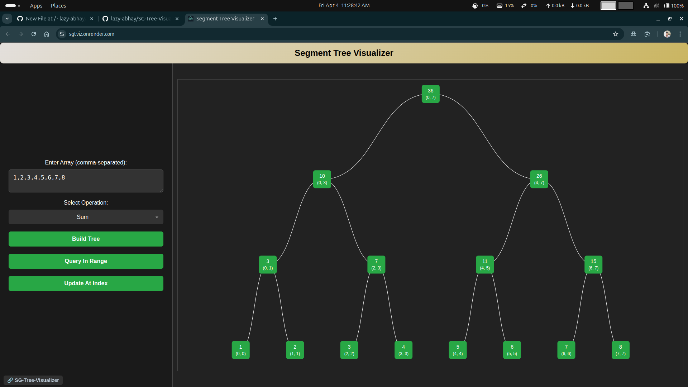

# SG-Tree-Visualizer

A web-based **Segment Tree Visualizer** that helps users understand how segment trees are built and queried. It allows users to input an array, construct the tree, perform range queries, and update values interactively.

## 🚀 Features

- 📊 **Tree Visualization**: Graphical representation of the segment tree.
- 🎛️ **User Interaction**: Build trees, query ranges, and update values dynamically.
- 🎨 **Improved Layout**: Optimized node spacing for better readability.
- 🌙 **Dark Theme**: Aesthetic dark-themed interface.

## 🔧 How to Use

1. **Enter an array** in the input field (comma-separated).
2. **Select an operation** (Sum, Min, Max, OR, AND, XOR).
3. **Click "Build Tree"** to visualize the segment tree.
4. **Query a range** to get computed results.
5. **Update a value** and see real-time changes.

## 📷 Screenshot



## 🛠️ Installation & Usage

Clone this repository and open `index.html` in your browser.

```sh
# Clone the repository
git clone https://github.com/lazy-abhay/SG-Tree-Visualizer.git

# Navigate to the project directory
cd SG-Tree-Visualizer

# Open index.html in a browser (For Windows)
start index.html

# OR (For macOS)
open index.html

# OR (For Linux)
xdg-open index.html
```

### Contribute

Fork the repo 🍴  

Create a new branch 🚀  

Commit your changes 🎯  

Open a Pull Request 📬  

If you like this project, drop a star ⭐ on GitHub!  
